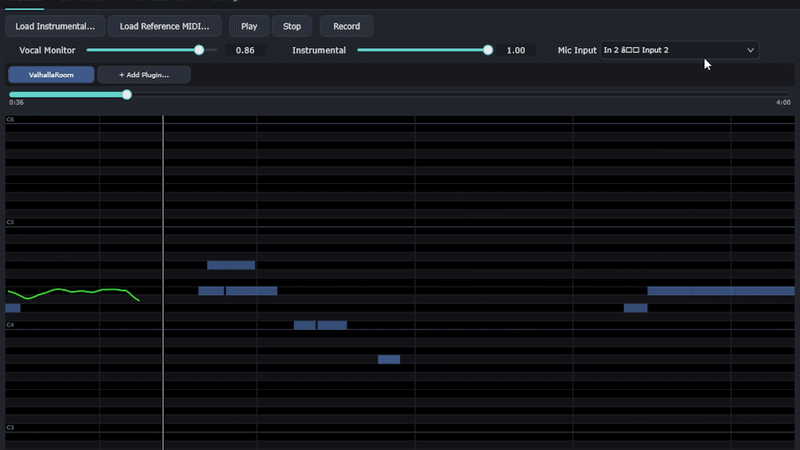

# SingingPracticeTool

A desktop app for solo vocal practice: sing along to an instrumental with live
pitch on a piano roll, run your mic through a VST chain for monitoring, extract
stems from any song or YouTube URL, and transcribe vocal takes to MIDI.



> **Status:** Windows-first. macOS support is planned but not yet implemented
> (`SidecarProcess` has a stub for the macOS branch; the C++ host is otherwise
> portable).

## Features

### Practice tab
Sing along to an instrumental while the piano roll scrolls your live pitch
against a reference MIDI. Mic runs through a VST3 plugin chain for monitoring.
Click/drag/wheel the timeline to scrub.

| Layer              | What it does                                    | Library / source |
|---|---|---|
| Audio I/O          | Device + driver enumeration, low-latency callbacks | [`juce::AudioDeviceManager`](https://docs.juce.com/master/classAudioDeviceManager.html) — ASIO + WASAPI on Windows |
| Pitch detection    | Real-time fundamental-frequency tracking         | Custom YIN-style detector ([`Source/Pitch/PitchDetector.cpp`](Source/Pitch/PitchDetector.cpp)), RT-safe (no allocs/locks) |
| Transport          | Sample-rate-aware playback + scrub               | [`juce::AudioTransportSource`](https://docs.juce.com/master/classAudioTransportSource.html) |
| VST hosting        | Load + run a chain of VST3 plugins on the mic    | [`juce::AudioPluginFormatManager`](https://docs.juce.com/master/classAudioPluginFormatManager.html) (VST3 only) |
| Piano roll + scrub | Live pitch trace, MIDI overlay, draggable timeline | Custom JUCE components — [`PianoRoll`](Source/UI/PianoRoll.cpp), [`TransportScrubber`](Source/UI/TransportScrubber.cpp) |

### Stem Extract tab
Drop a file or paste a YouTube URL → get vocals / drums / bass / other (or
vocals + accompaniment) as WAV stems. Runs on CUDA or CPU.

| Layer            | What it does                              | Library |
|---|---|---|
| Source separation | The actual `htdemucs` / `htdemucs_ft` / `mdx_extra` model inference | [Demucs 4](https://github.com/facebookresearch/demucs) (Meta) |
| Compute backend   | Tensor math on GPU or CPU                 | [PyTorch](https://pytorch.org/) (CUDA 12.8 wheel for Blackwell, falls back to CPU) |
| Audio decode      | Read any format ffmpeg understands        | `ffmpeg` subprocess via `demucs.audio.AudioFile` |
| Audio encode      | Write stem WAVs                            | [soundfile](https://github.com/bastibe/python-soundfile) (libsndfile) — bypasses `torchaudio.save` to avoid the torchcodec / FFmpeg-shared-lib chain |
| YouTube ingest    | Download a single video (no playlists)    | [yt-dlp](https://github.com/yt-dlp/yt-dlp) + ffmpeg postprocessor |

### Vocal → MIDI tab
Transcribe a vocal take to a `.mid` file with adjustable onset / frame / min-
note-length thresholds.

| Layer        | What it does                                          | Library |
|---|---|---|
| Transcription | Spotify's ICASSP 2022 multi-pitch model               | [basic-pitch](https://github.com/spotify/basic-pitch) — ONNX backend (not the default TF) |
| Compute      | Runs the model graph                                   | [ONNX Runtime](https://onnxruntime.ai/) (CPU; session cached at module scope so repeat calls amortise the ~500 ms load) |
| Audio decode | Pull samples + resample                                | [librosa](https://librosa.org/) |
| MIDI export  | Serialise notes to a `.mid` file                       | [pretty_midi](https://github.com/craffel/pretty-midi) |

### Settings tab
Audio device, driver (ASIO / WASAPI), sample rate, buffer size, channel
routing.

| Layer       | What it does                                  | Library |
|---|---|---|
| Device UI   | The device-picker composite                   | [`juce::AudioDeviceSelectorComponent`](https://docs.juce.com/master/classAudioDeviceSelectorComponent.html) |
| Persistence | Save/restore on every device change           | `AudioDeviceManager::createStateXml` → `%APPDATA%\SingingPracticeTool\device_settings.xml` (hash-deduped so a burst of broadcasts doesn't thrash the disk) |

### Shell + look
- **UI theme** — custom dark palette with a teal accent, in
  [`Source/UI/ModernLookAndFeel.cpp`](Source/UI/ModernLookAndFeel.cpp). Subclasses
  `juce::LookAndFeel_V4`; rounded buttons / inputs, slim sliders, minimal
  underline-style tabs.
- **Sidecar transport** — line-delimited JSON-RPC 2.0 over real Win32 pipes
  (since `juce::ChildProcess` can't write to a child's stdin). UTF-8 enforced
  on both sides so unicode filenames survive a YouTube → Stem → Vocal→MIDI
  round-trip.

## Install

The simplest path — grab the latest Windows installer from
[GitHub Releases](https://github.com/VanKyle00/SingingPracticeTool/releases):

1. Download `SingingPracticeTool-Setup-<version>.exe`.
2. First launch creates `%APPDATA%\SingingPracticeTool\` for device settings
   and `~\Music\SingingPracticeTool\` for recordings / stems / MIDI.

> The installer is unsigned, so Windows SmartScreen will show "Microsoft
> Defender prevented an unrecognized app from starting" on first run. Click
> **More info** → **Run anyway**. Code signing is on the roadmap.

If you want CUDA-accelerated stem separation / vocal-to-MIDI, install a recent
NVIDIA driver — the bundled PyTorch + ONNX Runtime detect CUDA at runtime and
fall back to CPU automatically.

## Build from source

Building yourself only makes sense if you want to modify the code. For
everyday use, the installer above is faster.

### Prerequisites (Windows)

1. **Visual Studio 2022 Build Tools** (or full VS) with the *Desktop
   development with C++* workload — provides MSVC + Windows SDK.
2. **CMake ≥ 3.22** — <https://cmake.org/download/>
3. **Python 3.13** — <https://www.python.org/downloads/>
   (3.11 / 3.12 will also work, but the sidecar install recipe below assumes
   3.13.)
4. **ffmpeg** — required by yt-dlp and Demucs.
   ```
   choco install ffmpeg
   ```
   Or download a static build and put `ffmpeg.exe` on `PATH`.
5. **NVIDIA GPU + recent driver** — optional, only if you want CUDA-accelerated
   Demucs / Vocal→MIDI. Without one, the sidecar falls back to CPU.

### 1. Clone

```powershell
git clone https://github.com/VanKyle00/SingingPracticeTool.git
cd SingingPracticeTool
```

### 2. ASIO SDK (optional, recommended for low-latency monitoring)

The Steinberg ASIO SDK is not redistributable, so you must fetch it yourself:

1. Download `asiosdk_2.3.3_2019-06-14.zip` from
   <https://www.steinberg.net/asiosdk>.
2. Unzip so that the path `third_party/asiosdk/common/iasiodrv.h` exists.

CMake auto-detects the SDK and enables JUCE's ASIO backend. Without it, JUCE
falls back to WASAPI (still usable, just higher latency).

### 3. Configure + build the C++ host

```powershell
cmake -S . -B build -G "Visual Studio 17 2022"
cmake --build build --config RelWithDebInfo --target App
```

The first configure clones JUCE 8.0.4 via `FetchContent` (~500 MB, ~45 s).
Incremental rebuilds take seconds.

Output: `build\App_artefacts\RelWithDebInfo\SingingPracticeTool.exe`.

### 4. Python sidecar

The sidecar handles Demucs (stem separation), yt-dlp (YouTube), and
basic-pitch (vocal-to-MIDI). It runs as a child process and talks JSON-RPC
over pipes.

```powershell
# From the project root
py -3.13 -m venv sidecar\.venv
sidecar\.venv\Scripts\python.exe -m pip install --upgrade pip

# 1. PyTorch (CUDA 12.8 build for RTX 30/40/50 series; use the CPU index URL
#    if you don't have an NVIDIA GPU).
sidecar\.venv\Scripts\python.exe -m pip install ^
    torch torchaudio --index-url https://download.pytorch.org/whl/cu128

# 2. Core deps (Demucs, yt-dlp, soundfile, torchcodec, basic-pitch's runtime
#    deps). The requirements file deliberately excludes basic-pitch itself —
#    its package metadata pins `tensorflow<2.15.1` and `resampy<0.4.3`,
#    neither of which builds on Python 3.13.
sidecar\.venv\Scripts\python.exe -m pip install -r sidecar\requirements.txt

# 3. basic-pitch with --no-deps (works fine — we already installed its real
#    runtime deps above).
sidecar\.venv\Scripts\python.exe -m pip install --no-deps basic-pitch==0.4.0
```


Expected: `CUDA: True` (if you have an NVIDIA GPU) and `basic-pitch OK`.

## Running

Launch `build\App_artefacts\RelWithDebInfo\SingingPracticeTool.exe`.

The host walks up from the exe looking for `sidecar/.venv/Scripts/python.exe`,
so as long as the venv is in the source tree (it is by default), the sidecar
spawns automatically on first use of the Stem Extract or Vocal→MIDI tabs.

**First-run defaults**
- Output recordings: `~\Music\SingingPracticeTool\vocal_dry_<timestamp>.wav`
- Stems: `~\Music\SingingPracticeTool\Stems\`
- MIDI: `~\Music\SingingPracticeTool\MIDI\`
- Device settings: `%APPDATA%\SingingPracticeTool\device_settings.xml`

## Architecture

- **C++ host**: JUCE 8 + CMake. `Source/` is organised by concern
  (`App/`, `Audio/`, `Pitch/`, `UI/`, `VST/`, `Sidecar/`).
- **Sidecar**: Python 3 package at `sidecar/practiceml/`. Line-delimited
  JSON-RPC 2.0 over the child's stdin/stdout (UTF-8). Real Win32 pipes —
  `juce::ChildProcess` can't write to stdin, so the transport is hand-rolled.
- **Audio thread invariant**: no allocations, no locks (try-lock or
  lock-free atomics), no logging. Enforced in `Engine::audioDeviceIOCallback`
  and `PitchDetector::process`.

See `CLAUDE.md` for deeper architectural notes and slice history.

## License

GPLv3 — see `LICENSE`.

The C++ host depends on [JUCE](https://juce.com/) 8, which is dual-licensed
(GPLv3 / commercial). Linking against JUCE under GPLv3 requires this project
to be GPLv3. For a permissive license you'd need a JUCE commercial license.

ASIO is a trademark and software of Steinberg Media Technologies GmbH; the
ASIO SDK is not redistributed with this repo.
